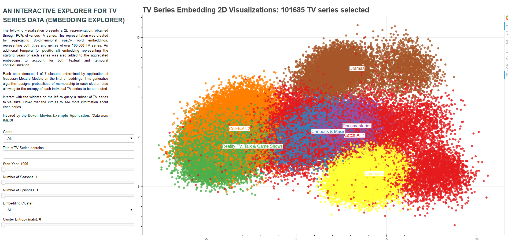
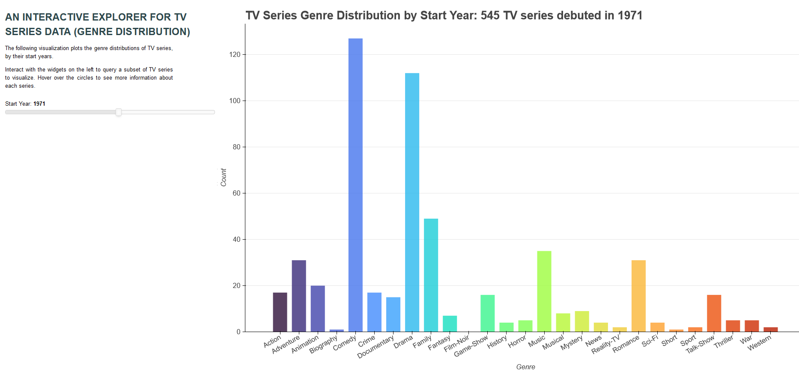

# tv-series-prediction
## Predicting the Durations of TV Series
***
This repository contains Python code to visualize and investigate TV series data downloaded from IMDB. The cleaned base dataset in [this CSV](base_data.csv) contains all necessary data to run these analyses. It contains over 100,000 TV series. Instructions on how to create the base dataset can be found [here](create_base_data.py). 

Objective | Description
--------- | -----------
1 |  Interactive Bokeh visualizations of **(1)** 2D embeddings representing TV series (titles + genres + start year) and **(2)** genre distributions by start year. 
2 |  Multiclass classification task of predicting duration categories of TV series, including investigation of reverse distillation. 

## Objective 1: Bokeh Visualizations
### Embedding Explorer
The embedding explorer is an interactive Bokeh visualization that enables users to query a 2-dimensional cluster representation of TV series along various dimensions (genres, start years, titles, runtimes, etc.). To properly execute the code, run the following::
    
    bokeh serve --show visualization1.py

### Genre Distributions

Genre distributions for TV series that debuted at specific years can also be queried by users. To properly execute the code, run the following:: 

    bokeh serve --show visualization2.py

